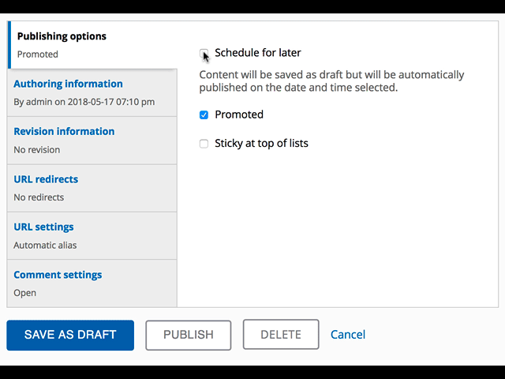

# Save Draft

`Save Draft` improves the usability of the content create/add page by removing
the "Published" checkbox under "Publishing options" tab, and replacing the
default "Save" button with a set of "Publish"/"Save Draft" buttons instead.
"Publish" will save the content in published status, and "Save as Draft" will
save it in unpublished status. The functionality remains the same, while
requiring a single click instead of multiple ones.

`Save Draft` supports the new feature that was introduced in Backdrop core after
version 1.10, which allows scheduled publishing of content. When a piece of
content is scheduled to be published, the "Publish" button changes to "Schedule
publication" button instead:

`Save Draft` also provides a per content type setting to allow drafts to be
saved even if any required fields are not filled in (you will still need to fill
these fields in order to publish the content).

## Installation

- Install this module using the official 
  [Backdrop CMS instructions](https://backdropcms.org/guide/modules)

## Usage

After enabling the module:

- Once you have enabled the module, the "Save Draft" button will be activated by
  default on all content types, while the "Skip Required Fields" functionality
  will be disabled by default.
- To adjust the default settings, simply edit a content type, and look under the
  "Publishing settings" tab for the "Save Draft" settings:
  
  

## Developers

If your module adds a button to the node form module and you are using the "Skip
required validation" option, you can allow your button to also skip required
validation by adding the `#skip_required_validation property` to your button.
For example, if you are adding a `'my_button'` button to the form actions, you
could add this property also:

`$form['actions']['my_button']['#skip_required_validation'] = TRUE;`

## Issues

Bugs and Feature requests should be reported in the 
[Issue Queue](https://github.com/backdrop-contrib/save_draft/issues)

## Current Maintainers

- [Laryn Kragt Bakker](https://github.com/laryn) - [CEDC.org](https://cedc.org)

## Credits

- Ported to Backdrop CMS by [Laryn Kragt Bakker](https://github.com/laryn) - 
  [CEDC.org](https://cedc.org).
- Current and past maintainers for the Drupal module:
  - [Pravin Ajaaz](https://www.drupal.org/u/pravin-ajaaz)
  - [ArunSelva](https://www.drupal.org/u/arunselva)
  - [Yorirou](https://www.drupal.org/u/yorirou)
  - [JulienD](https://www.drupal.org/u/juliend)
  - [valderama](https://www.drupal.org/u/valderama)
  - [ksenzee](https://www.drupal.org/u/ksenzee)
  - [Dan Jukes](https://www.drupal.org/u/danjukes)
- Support for the Drupal module is also provided by
  [Young Globes](https://www.drupal.org/young-globes)

## License

This project is GPL v2 software. See the [LICENSE.txt](https://github.com/backdrop-contrib/save_draft/blob/1.x-1.x/LICENSE.txt) 
file in this directory for complete text.
